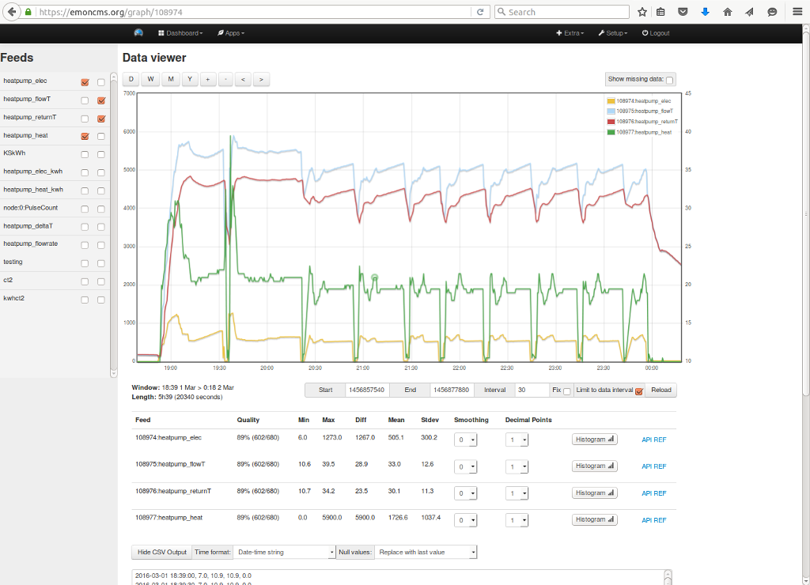
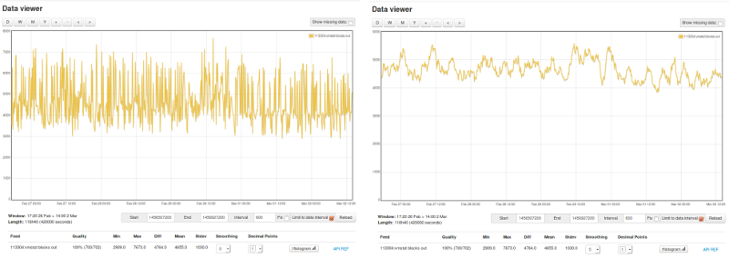
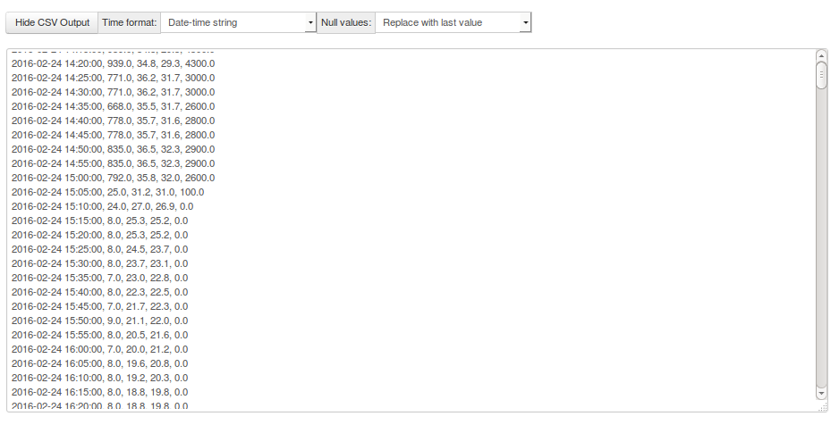

# Graph

A versatile graphing module for emoncms. This module is designed to replace the default data viewer in emoncms and is loaded when a feed view button is clicked.

# Install 

## 1. Install the Graph module

And ensure you are runing latest version and Emoncms

    cd /var/www/emoncms
    git pull
    cd /var/www/emoncms/Modules
    git clone https://github.com/emoncms/graph

Check for Database upates in Admin

## 2. Make Emoncms use graph module as defauld feed viewer

Add (or change) `$feedviewpath = "graph/";` in `settings.php`

# Change Log 

**V1**

- Multigraph viewer
- One click add remove feed left/right axis control
- Stats on feed quality, min, max, diff (max-min) mean & stdev.
- View a histogram of any feed, time at value or kWh at power.
- Smooth a noisy feed to see what is going on, select between 0 and 10 point moving average.
- Export data as CSV, select time format and whether to show, remove or use the last value when data is missing.

### Histogram

### Smoothing

### CSV Output

**Further development**

- Ability to save and load saved graph's
- Import graph built using graph into dashboards
- Tooltips
- Datapoint editor
- Selectable line or bar graph form on a per feed basis
- Selectable line color and fill.

Saved graphs produced with this module could replace vis module visualisations: realtime, rawdata, bargraph, graph, multigraph. Inbuilt data editing could replace edit daily and edit realtime. The histogram calculation on the fly can replace the need for the histogram input processor, feed engine and visualisations and on the fly averaging could replace the need for the PHPFiwa feed engine.
